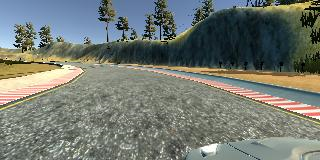

# Behavioral Cloning Project

**The project includes the following files:**
* model.py containing the script to create and train the model
* drive.py for driving the car in autonomous mode (No changes in the file)
* model.h5 containing my trained convolution neural network
* writeup_report.pdf summarizing the results

## Model Architecture and Training Strategy
### Collecting data strategy
I drove the car for seven laps in the left path and tried the following guidelines for data collection:
* four laps of center lane driving
* one lap of recovery driving from the sides, try to push the car to both edges and correct the path of the car
* two lap focusing on driving smoothly around curves

### Reading and processing the data
For the training of my model I decided to use four images, three camera images - center, left and right – along with the flipped version of the center image

 
Center camera image
  

 
Left camera image
  

 
Right camera image
  

 
Flipped center camera image

Then, I cropped the image from top (50 pixels) and bottom (20 pixels), so not to use more un-important data and to focus on the desired part of the image

And with the center image I recorded the steering as it is, but in case of left and right images I applied a correction factor of 0.1 after trying many factors that was appropriate for the softness of car movement.

For the flipped center image I multiplied the steering by -1.

And for normalization, a Lambda layer was used.

### The model architecture
When designing my model, I referred to [Nvidia paper End to End Learning for Self-Driving Cars](https://arxiv.org/pdf/1604.07316v1.pdf).

I used the same architecture:
* Normalization layer followed by
* 3 (5 x 5) convolutional layers with pooling of (2 x 2) and RELU activation
* 2 (3 x 3) convolutional layers and RELU activation
* 3 fully connected layers

I tried training the model with dropout of (0.5) and varying the value but it was always overfitting and crashing

I removed the dropout and tried training the model for 10 epochs, but it was overfitting after epoch number 5

So, best results I got when training the model with no dropouts for 5 epochs

For optimization, I used Adam optimizer and mean squared error (mse) to computer the error

I shuffled the data to enhance the quality of the training, and split the data into (80%-20%) training and validation

After applying my model, I noticed that the car is moving smoothly in the center of the road, performing well in the curves, but at the beginning of the bridge it slides to the left but it updates its path and continue the path correctly